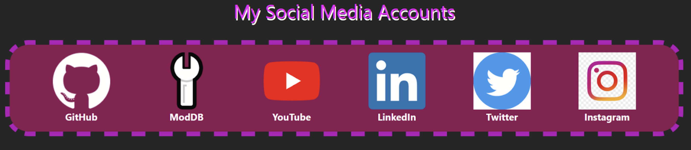
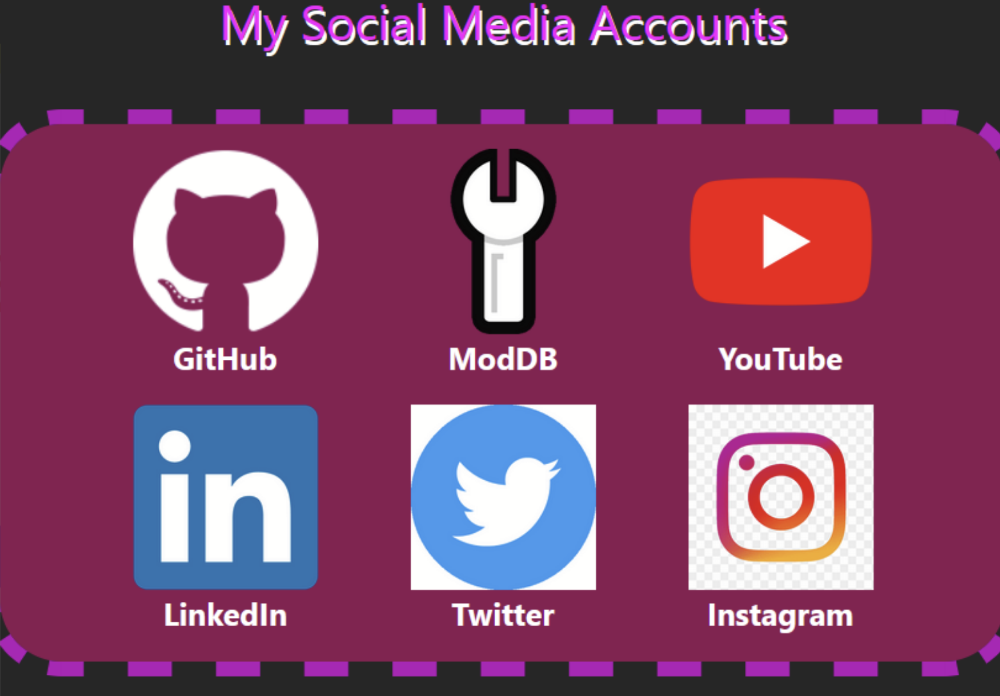

# Mio's CV assignments
Here I have couple of exercises to show as an example of my skills and experience so far. First one shows overall JavaScript skills, and working with API:s, second one shows that I can also do some CSS.

## 1. API-exercise
This is from Full Stack Open web course, which I was in progress of completing before I got accepted for this Trainee Academy course. 
This exercise is from the end of part 2 of the university course, and its called Data for countries. The task basically was to create a search engine for finding out data about countries. Task description can be found [here](https://fullstackopen.com/en/part2/adding_styles_to_react_app#exercises-2-18-2-20), and my solution can be found in this repository. Weather portion of the data unfortunately doesn't work right without my API-key. This was one of my favorite exercises last fall, and I was quite proud when I got it right.

## 2. CSS-exercise
This is from our Trainee Academy course, the assignment goes like this: 

### a)

Using your knowledge of Bootstrap and what you’ve learned so far, re-create the following page with HTML, Bootstrap and CSS.

Each icon and the text under it should be inside one element that’s a link to the respective page.

You can fetch the icons for the social media services from below:

### EXTRA: b), Responsivity

Make the page scale to different screen sizes. On a widescreen desktop monitor with a maximized browser window, the icons should be arranged as in a). On a small browser window, the icons should collapse into multiple rows like this:

My solution can be found in this repository, this exercise just took some attension to detail, and some testing and learning with css and bootstrap. Just open the html-file from your computer to see the final product. 

### Rest of my Full Stack Open exercises can be found in my other repos named by parts of the course, most of those programs work only locally.
